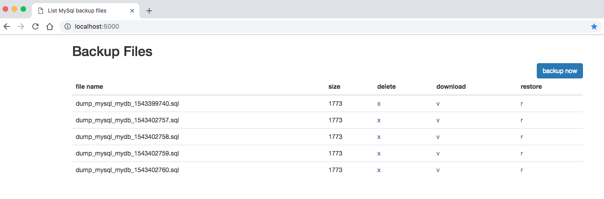

# How to use

please check out the [example](https://github.com/newnewcoder/dockerfiles/blob/master/simple-mysql-auto-backup/example/docker-compose.yml)

this docker image is use for `docker-compose` to auto backup mysql db to local storage by easy settings,
and provide a simple web console to backup immediately、restore and delete old dump file.

# How to build

~~~bash
docker build -t newnewcoder/mysql-autobackup:latest . --no-cache
~~~
